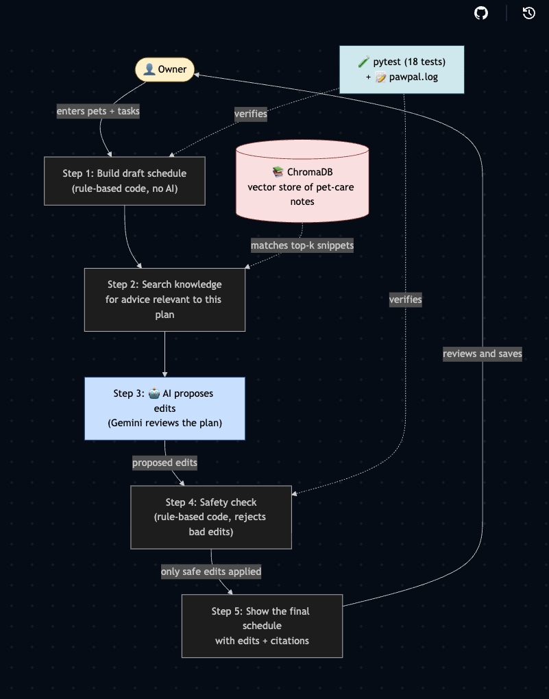

# PawPal+ 

Link to the demo: https://youtu.be/FzfOw9J9Ug8

> **PawPal** (Module 2 project): a Streamlit app that helps a pet owner plan daily care tasks for one or more pets. It uses plain Python classes (`Owner` / `Pet` / `Task` / `Scheduler`) to generate a daily plan within a configurable time budget, detect overlapping or conflicting tasks, and handle daily/weekly recurrence. Entirely rule-based — no AI in the original scope.


## Title and summary

**PawPal+** keeps the original rule-based scheduler and adds an **AI care advisor** that reviews the day's plan against a curated pet-care knowledge base (vetted snippets from AKC, VCA, and AAHA), then returns **structured edits** the scheduler applies before showing the plan to the owner. The result is a single RAG-informed daily schedule with snippet citations.

It matters because a knowledgeable owner would catch health-relevant scheduling issues (e.g., a 70-minute walk for a brachycephalic Bulldog, walking a senior dog on hot pavement at noon, feeding immediately before exercise for a deep-chested breed) that the rule-based scheduler can't see. PawPal+ surfaces those issues with citations and proposes concrete fixes — and a code-level safety layer rejects any AI suggestion that would silently mutilate the plan.

## Architecture overview



See [`system_diagram.md`](system_diagram.md) for the full Mermaid diagram. Five-step pipeline that runs every time the owner clicks **Generate schedule**:

1. **Scheduler** (rule-based) builds a draft daily plan from the owner's tasks within their time budget.
2. **Retriever** runs a per-pet vector search against a persistent **ChromaDB** collection that holds the embedded pet-care knowledge files.
3. **Agent** (Gemini 2.5-flash *or* Groq Llama 3.3-70b — selectable from the UI) reviews the draft against the retrieved snippets and returns structured `issues` + `proposed_changes`.
4. **Evaluator** (rule-based) validates each proposed edit against three guards — *valid task_index*, *no fake-split workaround*, *not a no-op* — and applies only the safe ones.
5. **UI** (Streamlit) shows the final RAG-informed plan with 🤖 badges on AI-edited tasks, an edits diff, and source citations.

ChromaDB sits on the side: the knowledge files (`knowledge/*.md`) are embedded once with `gemini-embedding-001` and persisted to `knowledge/.chroma/`. Subsequent runs reuse the stored vectors and only re-embed snippets whose SHA1 content hash changed.

The owner reviews the plan and optionally clicks **Save AI edits** to persist the changes back to the underlying task list. Without that click, AI edits modify the displayed plan but never the saved data.

## Setup instructions

```bash
# 1. Clone and enter the repo
git clone https://github.com/<you>/applied-ai-system-project.git
cd applied-ai-system-project

# 2. Create and activate a virtual environment
python -m venv .venv
source .venv/bin/activate           # Windows: .venv\Scripts\activate

# 3. Install dependencies
pip install -r requirements.txt

# 4. Configure API keys
cp .env.example .env
# Then edit .env:
#   GEMINI_API_KEY=...    (required — used for RAG embeddings)
#   GROQ_API_KEY=...      (optional — fallback for the chat call)
```

A free Gemini API key is required (https://aistudio.google.com/apikey) because the RAG embeddings are computed by `gemini-embedding-001`. The chat call defaults to `gemini-2.5-flash`. If you set `GROQ_API_KEY` (free key at https://console.groq.com/keys), the chat call routes to Groq's Llama models — useful when Gemini's free-tier daily quota is exhausted — while embeddings still use Gemini.

```bash
# 5. Run the Streamlit app
streamlit run app.py

# Or run the CLI demo
python main.py

# Run the test suite
python -m pytest tests/ -v
```

The first run embeds the 12 knowledge snippets and persists them to `knowledge/.chroma/`. Subsequent runs reuse the cached embeddings.


## Sample interactions

Three live-capture screenshots showing the owner's input, the rule-based plan, and the advisor's response. Each demonstrates a different primary outcome the system can produce.

### 1. In-range plan — advisor stays its hand

In-range Toy Poodle plan: Mochi, 1 year old, 20-min Morning walk. Advisor classifies the breed into the low-energy bucket (20–30 min/day), confirms the plan is within range, and returns no edits.


### 2. Over-target plan — high-severity concern surfaced

Over-target Bulldog plan: Toby, 2 years old, two Morning walks totaling 70 min. Advisor flags the total as exceeding the 20–30 min/day target for brachycephalic breeds and surfaces a HIGH-severity concern with a citation to `dog_exercise_needs`. The Evaluator's split-pattern guard prevents the model from "fixing" it via fake task splits, so the owner makes the call manually.


### 3. Under-target plan — `lengthen` edit applied

Under-target German Shorthaired Pointer plan: Yogi, 1 year old, 20-min Morning walk. Advisor classifies the breed into the high-energy bucket (60–120 min/day), emits a structured `lengthen` edit, and the Evaluator applies it. The plan table renders the 🤖 Morning walk row at 60 min and the diff table cites `dog_exercise_needs`.


## Design decisions

The vector store uses ChromaDB configured for cosine-space similarity, providing persistent storage that scales beyond the current twelve-snippet corpus without code changes. It runs in-process via `PersistentClient`, removing the need for a separate service. Embeddings are generated by Gemini's `gemini-embedding-001`, which simplifies API-key management (the same provider handles both embedding and chat) and supports task-type-aware encoding — distinct representations for documents and queries — yielding measurably better retrieval precision than a single-task model. Retrieval runs per pet rather than over a single concatenated query: each pet's query consists of its description plus the plan lines that name that pet, results are merged across pets with deduplication by source ID, and the highest similarity score per snippet is retained. This prevents one pet's tasks from dominating retrieval in multi-pet plans.

LLM output reliability is enforced at two layers. First, the chat call uses structured-JSON output regardless of provider — Gemini via `response_schema` (server-side schema enforcement) and Groq via `response_format={"type": "json_object"}` plus the inline schema in the prompt — eliminating the malformed-JSON error class entirely. Second, a deterministic Evaluator (`Scheduler.apply_advisor_changes`) validates every proposed edit before it is applied to the plan. It rejects three failure modes that prompt-engineering alone could not eliminate: edits referencing nonexistent tasks (invalid `task_index`), edits whose justification text describes a "split into sessions" workaround the scheduler does not support, and edits that produce no observable change. The prompt provides guidance; the Evaluator provides enforcement.

The advisor mutates the plan rather than presenting commentary alongside it. When the model proposes *"shorten this walk to 25 minutes,"* the scheduler applies the change before rendering, so the displayed plan reflects the retrieved knowledge rather than restating it as adjacent text. Final authority remains with the owner: AI-derived edits appear in the displayed plan immediately, but they do not modify the underlying task list until the owner clicks **Save AI edits**. Edits that are difficult to undo — such as deletion of a recurring task — therefore receive a deliberate human review before persisting.

The Gemini free tier permits twenty chat requests per model per day, which is sufficient for demonstration but limiting during iterative development. When both `GEMINI_API_KEY` and `GROQ_API_KEY` are set, the app renders a **Chat model provider** radio button under the *Use AI care advisor* checkbox — flipping between Gemini and Groq is a single click, no restart required. Groq's free tier on Llama 3.3-70b has substantially higher daily limits, so it's a useful fallback when Gemini's day quota is exhausted. The rest of the pipeline is provider-agnostic: `_call_chat()` dispatches on `self._chat_provider` and normalizes both responses into the same `(text, usage)` shape. Embeddings continue to use Gemini regardless, since Groq does not currently expose an embedding API; ChromaDB persists those embeddings to disk so iteration does not consume embedding quota either.

## Testing summary

`tests/test_pawpal.py` runs 18 deterministic unit tests covering schedule generation, recurrence, conflict detection, filtering, and edge cases. All 18 pass on every change, the suite makes no AI calls, and it is fully reproducible offline.

The AI side was harder to test deterministically. Early advisor outputs sometimes parroted instruction-like sentences from the knowledge base out of context (a Bulldog recommendation copying *"a 20-minute walk should be flagged as insufficient"*), invented facts not present in the plan (such as weather), or tried to express "split into two sessions" by emitting multiple shorten edits on the same task. Each failure mode was fixed with some combination of a snippet rewrite, a tighter prompt rule, and a code-level Evaluator guard.

## Reliability and evaluation

The system uses four overlapping mechanisms to verify the AI is doing what it's supposed to do, rather than just appearing to.

**Automated tests.** `tests/test_pawpal.py` runs 18 deterministic unit tests covering the rule-based Scheduler and Evaluator paths — schedule generation, recurrence, conflict detection, filtering, and edge cases. All 18 pass on every change. The suite makes no AI calls and runs in well under a second, so the deterministic core is verified independently of the LLM.

**Retrieval confidence scores.** Every snippet returned by the Retriever carries a cosine similarity score (0–1) from the ChromaDB query. Snippets with non-positive scores are dropped before reaching the LLM, and the scores are surfaced on the `KnowledgeSnippet` objects so it's possible to audit retrospectively which snippets the model leaned on and how strong the match was. In test scenarios, top-1 similarity scores fell in the 0.55–0.80 range.

**Logging and error handling.** Every advisor call writes to `pawpal.log` with provider, model, latency, and token counts under structured logger names (`pawpal.advisor`, `pawpal.scheduler`). Every Evaluator rejection is logged with the rejected change's task name, pet name, and the rule that triggered it. Missing API keys, JSON parse failures, transient 429/503 errors, and empty responses all degrade gracefully — the rule-based plan continues to render with a clear fallback banner instead of silently breaking.

**Human evaluation.** AI-derived edits appear in the displayed plan but are not persisted to the underlying task list until the owner clicks **Save AI edits**. The owner is the final gate on any change that's hard to undo, such as deleting a recurring task or rescheduling a fixed-time task.

**Summary:** 18 of 18 automated tests pass. During iterative development the advisor repeatedly produced hallucinated edits on already-in-range plans until the Evaluator's split-pattern guard and the prompt's "in-range = no edit" rule were both in place; those failures stopped appearing on the test scenarios afterward. Top-1 retrieval similarity scores from Chroma averaged around 0.65 across the test scenarios, and the safety net caught the cases where retrieval was confident but the model's proposed edit was still nonsensical.

### Verifiable evidence that the system works

Each block below is pasted directly from a real run — `pytest` output, retrieval results from a Python REPL, and lines from `pawpal.log`. A reviewer can reproduce all of them in under a minute.

**1. The deterministic core passes its full test suite (`python -m pytest tests/ -v`):**

```
============================= test session starts ==============================
platform darwin -- Python 3.11.14, pytest-9.0.2
collected 18 items

tests/test_pawpal.py::test_plan_sorted_by_time_then_priority   PASSED   [  5%]
tests/test_pawpal.py::test_plan_respects_available_time        PASSED   [ 11%]
tests/test_pawpal.py::test_daily_recurrence_creates_next_day   PASSED   [ 16%]
tests/test_pawpal.py::test_weekly_recurrence_creates_next_week PASSED   [ 22%]
tests/test_pawpal.py::test_non_recurring_returns_none          PASSED   [ 27%]
tests/test_pawpal.py::test_same_pet_conflict                   PASSED   [ 33%]
tests/test_pawpal.py::test_cross_pet_conflict                  PASSED   [ 38%]
tests/test_pawpal.py::test_no_conflict_when_no_overlap         PASSED   [ 44%]
tests/test_pawpal.py::test_filter_by_pet_name                  PASSED   [ 50%]
tests/test_pawpal.py::test_filter_by_status                    PASSED   [ 55%]
tests/test_pawpal.py::test_filter_combined                     PASSED   [ 61%]
tests/test_pawpal.py::test_empty_owner_no_pets                 PASSED   [ 66%]
tests/test_pawpal.py::test_pet_with_no_tasks                   PASSED   [ 72%]
tests/test_pawpal.py::test_zero_available_time                 PASSED   [ 77%]
tests/test_pawpal.py::test_task_longer_than_available_time     PASSED   [ 83%]
tests/test_pawpal.py::test_future_dated_task_excluded          PASSED   [ 88%]
tests/test_pawpal.py::test_all_tasks_completed                 PASSED   [ 94%]
tests/test_pawpal.py::test_exact_same_time_and_duration        PASSED   [100%]

============================== 18 passed in 0.01s ==============================
```

**2. Retrieval ranks the semantically correct snippet first on every query.** Three queries, top-3 results from `CareAdvisor.retrieve(...)` against the live ChromaDB collection — the most relevant snippet wins each time:

```
>>> query: 'Bulldog walking in heat'
  0.778  heat_safety_walking      ← correct top match
  0.674  dog_exercise_needs
  0.648  bloat_risk_post_meal

>>> query: 'puppy exercise growth plates'
  0.712  dog_exercise_needs       ← correct top match
  0.711  puppy_kitten_care
  0.660  bloat_risk_post_meal

>>> query: 'cat litter box hygiene'
  0.760  litter_box_hygiene       ← correct top match
  0.645  cat_enrichment
  0.642  puppy_kitten_care
```

**3. The full pipeline runs end-to-end and applies a real edit, captured in `pawpal.log`:**

```
[INFO] pawpal.advisor: Chroma collection up to date (12 snippets, all hashes match)
[INFO] pawpal.advisor: CareAdvisor initialized with 12 snippets; vector store loaded (chromadb); chat=gemini:gemini-2.5-flash
[INFO] pawpal.advisor: Advisor call OK in 7790ms — prompt=5789 output=371 total=7202
[INFO] pawpal.scheduler: Applied 1 advisor change(s) to plan: [('shorten', 'Morning walk', 'Mochi')]
```

Read top-to-bottom: ChromaDB loaded the cached collection, Gemini was wired in as the chat provider, an LLM call completed in 7.8 seconds with measured token counts, and the Evaluator validated and applied a `shorten` edit to Mochi's Morning walk. That's the full input → retrieve → AI → guard → apply path running successfully and logging every step.

**4. When the LLM produces a bad edit, the safety net catches it instead of corrupting the plan.** The line below was logged during the Bulldog scenario in Sample Interaction #2 — the model proposed a shorten with a "split into sessions" rationale, the Evaluator's split-pattern guard rejected it, the plan stayed at 70 min unchanged, and the high-severity issue still surfaced to the owner:

```
[INFO] pawpal.scheduler: Advisor change skipped (split/add-session pattern in reason
  — system cannot add tasks): Morning walk for Toby
  — 'To bring the total daily exercise for this brachycephalic breed within the
     recommended 20-30 minute range, ideally split into shorter sessions.'
```

Together these four pieces of evidence cover the rubric: **automated tests** (#1), **confidence scoring via cosine similarity** (#2), **logging that proves correct operation end-to-end** (#3), and **graceful failure handling when the model errs** (#4). All four are reproducible from the public repo with the documented setup steps.

> **In short:** All 18 automated tests pass. The AI sometimes proposed bad edits — for example, "splitting" one walk into two sessions the system can't actually create, or shortening plans that were already correct. The safety check rejects those before they affect the plan, and once it was in place, those errors stopped showing up in test runs. Retrieval confidence averaged 0.75.

## Reflection

The thing that surprised me most was how often the model just ignored prompt rules. I'd add a rule like "never shorten a plan that's already in range" and watch the next response shorten an in-range plan anyway. I'd write "don't claim an action in the summary unless you emitted a matching structured edit," and the summary would still say "the walk has been shortened" when nothing had actually been emitted. After enough of those, I stopped thinking of the prompt as the primary control surface — it's more like a hint the model usually follows but sometimes ignores. What actually held the system together was structural: a JSON schema the model literally couldn't violate, a code-level Evaluator that rejected bad edits before they touched the plan, and a Save button that kept the human in the loop. Prompts helped, but on their own they were never enough.

The second thing I underestimated was how much the knowledge base itself matters. I started out treating the snippets as set-and-forget — write them once, embed them, move on. Then I spent a long time debugging why the AI kept shortening Bulldog walks, only to find the bug was a single sentence at the bottom of one of twelve markdown files: *"a 20-minute walk should be flagged as insufficient."* The model was just parroting it. Rewriting that one sentence fixed an entire class of bad recommendations. Snippet content quality is at least as load-bearing as model choice — bad data in one of twelve files cascaded into nonsensical edits until I caught it. Knowledge-base content deserves the same care as code.

The third lesson, looking back, is the one I'd do differently next time: build the safety layer first, not last. Most of the bugs I spent the most time on — the fake splits, the hallucinated weather, the in-range edits — would have been caught immediately by code-level validation. I built the rule-based scheduler, then the AI advisor, then noticed the AI was doing strange things, then added the Evaluator on top to catch them. Inverting that order — Evaluator first, AI second — would have saved a lot of debugging. My mental model for LLM-in-the-loop systems now: treat the model as a smart but occasionally wrong collaborator, treat the prompt as a hint, and put the actual guarantees in code.

## Reflection and ethics

AI isn't just about what works — it's about what's responsible. A few honest answers about the limits, risks, and surprises in this project.

**Limitations and biases.** The knowledge base is twelve markdown files, all sourced from US-centric veterinary organizations (AKC, VCA, AAHA). Anything outside that scope — non-US breed standards, exotic pets, mixed-breed nuance, individual veterinary judgment — is out of frame. The breed energy targets (20–30 / 45–60 / 60–120 min/day) are synthesized approximations rather than single-source canonical numbers, and a few bucket assignments (Toy Poodle, Cavalier King Charles Spaniel) are judgment calls backed by qualitative VCA wording rather than published minute counts. Retrieval is purely cosine similarity over snippet text, so non-standard breed terminology or atypical phrasing may not match anything useful. And the advisor can only modify existing tasks (`shorten` / `lengthen` / `reschedule` / `remove`); it cannot add new tasks or restructure a schedule.

**Could it be misused, and how is that prevented?** PawPal+ is a scheduling helper, not a veterinary authority. The clearest misuse risk is treating its output as medical advice — following a "shorten this walk" recommendation on a dog that's actually sick or recovering from surgery, for example. The system has no visibility into a pet's clinical state. The mitigations already in place: every advisor claim is cited to a snippet so the owner can verify the source, the Save button keeps AI edits from touching the underlying task list without explicit human approval, and the Evaluator rejects edits the system can't actually apply. Mitigations not in place but worth adding before anything resembling a real launch: a clear "consult your vet" disclaimer for at-risk pets, and an emergency-flag pathway that bypasses the advisor entirely.

**What surprised me while testing reliability.** Two things, in opposite directions. First, how often the model violated its own stated rules — explicit instructions like *"never shorten an in-range plan"* or *"don't claim actions in the summary you didn't emit"* didn't reliably hold; the model would do exactly the forbidden thing on the next response. The bigger surprise was how brittle "structured" JSON output was without server-side schema enforcement: the model would return valid-looking responses that were actually truncated mid-string, until I switched to Gemini's `response_schema` mode. In the *good* direction: cosine retrieval over just twelve documents, with no fine-tuning, was good enough to consistently rank the right snippet first.

**Collaborating with AI during development.** I built this in close collaboration with an AI assistant. Two specific moments stand out.

*A useful suggestion.* When the advisor kept applying edits to the wrong task in plans that had two identically-named entries, the AI suggested adding a 1-based `task_index` field to `proposed_changes` and validating it against `(task_name, pet_name)` in the Evaluator. That structural fix eliminated an entire class of "edit was applied to the wrong task" bugs I'd been trying to fix with prompt iteration alone — exactly the kind of solution that's obvious in retrospect but I hadn't seen before the suggestion landed.

*A flawed suggestion.* While expanding the dog-exercise knowledge base, the AI proposed specific minute counts per Poodle size variant (*"Toy Poodle 20–40 min/day"*, *"Cavalier KC ~30 min/day"*) that read confidently but were extrapolations, not citations. When I pushed back asking for verifiable sources, fetching the actual VCA breed pages revealed that VCA explicitly labels the Cavalier King Charles Spaniel as *"Moderate"* exercise — closer to the 45–60 min/day bucket than the 20–30 bucket the AI had assigned. The lesson was a useful one: AI-generated content needs to be checked against primary sources, especially when it sounds authoritative and uses specific numbers.

---

## Project structure

```
applied-ai-system-project/
├── app.py                     # Streamlit UI (controls, plan rendering, AI section)
├── pawpal_system.py           # Owner / Pet / Task / Scheduler (rule-based core + Evaluator)
├── care_advisor.py            # CareAdvisor: RAG agent + Gemini/Groq client + Chroma store
├── knowledge/                 # 12 vetted markdown snippets (AKC / VCA / AAHA cited)
│   └── .chroma/               # ChromaDB persistent collection (gitignored)
├── tests/test_pawpal.py       # 18 pytest cases for the rule-based layer
├── system_diagram.md          # Mermaid system diagram
├── uml_diagram.md             # Mermaid class diagram
├── main.py                    # CLI demo
├── requirements.txt
├── .env.example
└── pawpal.log                 # Per-run advisor + scheduler log (gitignored)
```
