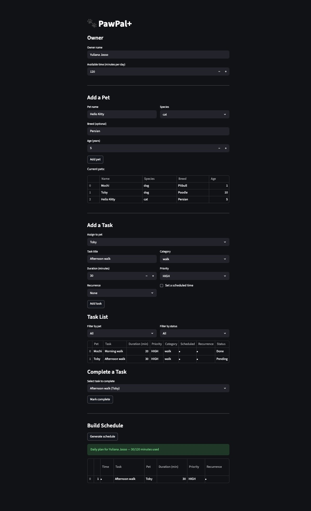

# PawPal+ (Module 2 Project)

**PawPal+** is a Streamlit app that helps a pet owner plan daily care tasks for their pets. It generates smart, prioritized schedules while detecting conflicts and handling recurring tasks automatically.

## Demo



## Features

- **Time-based sorting** — Tasks with a scheduled time (e.g., 07:00) are placed first in chronological order. Unscheduled tasks follow, sorted by priority (HIGH > MEDIUM > LOW) then duration (shorter first). Uses `sorted()` with a lambda key.
- **Filtering by pet or status** — View tasks for a specific pet, only incomplete tasks, only completed tasks, or any combination. Available in both the CLI demo and the Streamlit UI via dropdown selectors.
- **Daily and weekly recurrence** — Mark a task as `"daily"` or `"weekly"`. When completed, a new instance is automatically created with the next due date calculated using Python's `timedelta` (+1 day or +7 days). Future-dated tasks stay hidden until their day arrives.
- **Conflict detection** — The scheduler checks every pair of scheduled tasks for overlapping time windows and labels each as:
  - `SAME-PET` — Two tasks for the same pet overlap (physically impossible)
  - `CROSS-PET` — Tasks for different pets overlap (may need coordination)
  
  Warnings are displayed prominently in the UI without crashing the program.
- **Greedy time-budget scheduling** — The scheduler fills available minutes by fitting as many tasks as possible, prioritizing high-priority and shorter tasks first. Tasks that don't fit are listed as "skipped."
- **Task completion with recurrence feedback** — When a recurring task is marked done in the UI, the owner sees a confirmation and the next occurrence date.

## Getting started

### Setup

```bash
python -m venv .venv
source .venv/bin/activate  # Windows: .venv\Scripts\activate
pip install -r requirements.txt
```

### Run the app

```bash
streamlit run app.py
```

### Run the CLI demo

```bash
python main.py
```

## Architecture

The system is built from five classes in `pawpal_system.py`:

| Class | Responsibility |
|-------|---------------|
| `Priority` | IntEnum defining HIGH (1), MEDIUM (2), LOW (3) |
| `Task` | A single care activity with duration, priority, scheduled time, recurrence, and due date |
| `Pet` | A pet with a name, species, and a list of tasks |
| `Owner` | The pet owner with available time and a list of pets |
| `Scheduler` | Generates daily plans, sorts by time, filters tasks, and detects conflicts |

See `uml_diagram.md` for the full Mermaid class diagram, or `uml_final.png` for the rendered image.

## Testing PawPal+

Run the full test suite with:

```bash
python -m pytest tests/test_pawpal.py -v
```

The suite includes **18 automated tests** organized into five categories:

| Category | Tests | What they verify |
|----------|-------|------------------|
| Schedule generation | 2 | Tasks are sorted by scheduled time first, then by priority/duration. Only tasks within the time budget are included. |
| Recurring tasks | 3 | Daily completion creates a task due tomorrow (+1 day). Weekly creates one due next week (+7 days). Non-recurring tasks produce no new instance. |
| Conflict detection | 3 | Same-pet overlaps produce a SAME-PET warning. Cross-pet overlaps produce a CROSS-PET warning. Non-overlapping tasks produce zero conflicts. |
| Filtering | 3 | Filter by pet name, by completion status, or both combined. |
| Edge cases | 7 | No pets, no tasks, zero available time, task too long, future-dated recurring task, all tasks completed, two tasks at exact same time. |

**Confidence Level: 4/5 stars**

The test suite covers all core scheduling behaviors, both happy paths and edge cases. The one star deducted is because the tests do not yet cover the Streamlit UI layer (app.py) or multi-day scheduling scenarios where recurring tasks chain across several days.
