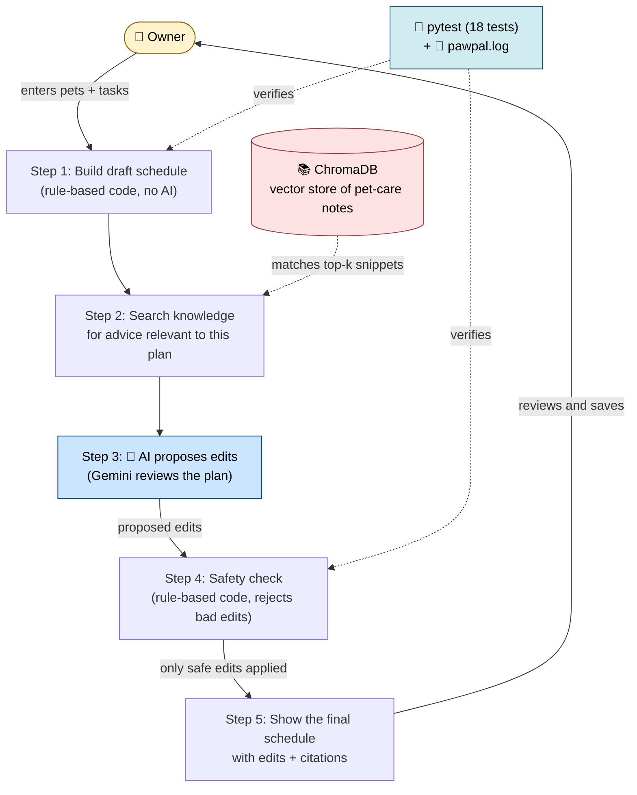

# PawPal+ System Architecture

The whole system is **5 steps in a row**, plus a **knowledge store on the side** and **tests/logs that watch over it**.

## Walkthrough — what happens when the owner clicks "Generate"

1. **Step 1 — Build draft schedule.** The Scheduler is a simple rule-based program (no AI). It packs as many of the owner's tasks as fit in the day's time budget.
2. **Step 2 — Search knowledge.** For each pet, the Retriever runs a vector search against **ChromaDB** (which holds the embedded pet-care notes from `knowledge/*.md`) and pulls back the most relevant snippets.
3. **Step 3 — AI proposes edits.** The Agent (Gemini LLM) reads the draft schedule and the retrieved snippets, then returns a structured list of suggested edits with citations. **This is the only AI step.**
4. **Step 4 — Safety check.** The Evaluator is rule-based code that rejects unsafe AI edits before they touch the plan. It checks each proposed edit and skips it if any of these are true:
   - The edit points to a task that doesn't exist.
   - The edit's reason mentions "split" or "two sessions" (the AI tries to fake adding a task this way — our system can't add tasks).
   - The edit is a no-op (e.g., shortens a 20-min walk to 20 min).
5. **Step 5 — Show the final schedule.** Streamlit displays the final plan with 🤖 badges on AI-edited tasks, a clear diff, and source citations. The owner reviews, then clicks *Save AI edits* to persist them.

## Where humans and tests check the AI

- **The owner is the final reviewer.** AI edits show up in the schedule, but they don't change the underlying task list until the owner clicks Save.
- **`pytest` (18 tests)** verifies the rule-based parts (Steps 1 and 4). No AI is called in tests, so the tests are deterministic and fast.
- **`pawpal.log`** records every AI call and every safety-check rejection, so we can audit the AI's behavior after the fact.

## Color guide

- 🟦 **Blue (Step 3)** — the only step that uses an AI model.
- 🟥 **Pink (ChromaDB)** — the data store the AI gets its knowledge from.
- 🟨 **Yellow (Owner)** — the human in the loop.
- 🟦 **Light blue (Tests + logs)** — automated verification.
- ⬜ **Plain (Steps 1, 2, 4, 5)** — rule-based code, no AI.
